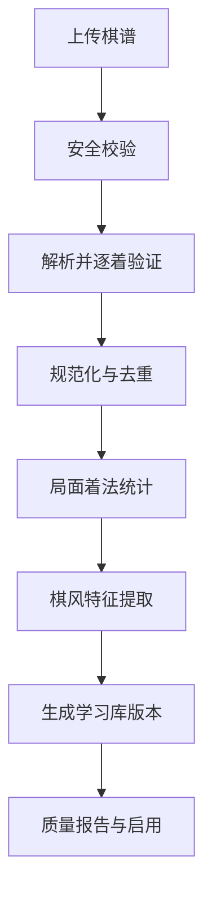

# 中国象棋人机对战与棋谱学习软件：Codex 开发 Prompt

> 使用方式：将本文件中“Prompt 正文”完整复制给 Codex。若已有代码仓库，让 Codex 先审查现状再实施；若是空目录，则按本文的默认技术栈初始化项目。

---

## Prompt 正文

你是一名资深 Golang 架构师、中国象棋规则引擎工程师、AI 棋类应用工程师和产品设计师。请为我从零设计并开发一款“可导入棋谱学习、可调节难度的人机对战中国象棋软件”。

项目暂定名：**棋境（Xiangqi Lab）**。

这不是简单地调用随机走棋接口，也不是用聊天大模型伪装成象棋 AI。系统必须具备独立、可测试的中国象棋规则核心、合法走子验证、局面表示、对弈引擎适配层、棋谱解析管线、棋谱学习机制、难度配置和复盘能力。

### 1. 开始工作前的强制要求

1. 先检查当前仓库结构、`README`、`AGENTS.md`、现有依赖、未提交改动和已有代码，不覆盖或删除用户已有实现。
2. 若仓库为空，建立前后端分离的 monorepo；若仓库已有技术栈，优先复用，只有存在明确阻塞时才迁移。
3. 先输出以下内容，再开始编码：
   - 当前仓库评估；
   - MVP 范围；
   - 关键技术决策及取舍；
   - 分阶段实施计划；
   - 风险清单，尤其是象棋规则、棋谱兼容、强引擎进程管理与开源许可证。
4. 按“可运行的纵向切片”迭代，每个阶段都必须包含代码、测试、文档和验证结果。不要一次生成大量无法运行的空壳文件。
5. 不允许用假数据掩盖未实现功能；未完成的高级能力必须明确标为后续阶段。
6. 所有外部输入、坐标转换、局面哈希、引擎输出都必须经过服务端校验，前端不能作为规则权威来源。

### 2. 产品定位

面向中国象棋爱好者，提供四项核心价值：

1. **人机对战**：选择执红、执黑或随机先后手，选择难度、思考时间和棋风后开始对局。
2. **棋谱学习**：导入用户提供的棋谱，系统抽取开局选择、常见局面、着法概率、胜负结果和棋风特征。
3. **风格化 AI**：用户可选择“标准引擎”“按指定棋谱库走棋”“模仿某个棋谱集合的棋风”三种模式。
4. **对局复盘**：展示关键失误、候选着、局面评分变化、开局命中情况，以及 AI 本局有多少着参考了学习库。

首版优先做响应式 Web/PWA，兼顾桌面和移动端。架构需允许后续通过 Tauri 或其他桌面壳打包，但 MVP 不因桌面打包而延期。

### 3. 必须正确表达“棋谱学习”

不要宣称少量棋谱可以直接训练出一个高棋力神经网络。首版采用可解释、工程上可落地的三层学习方案：

#### 3.1 开局与局面着法库

将每盘棋按着法回放，针对每个规范化局面记录：

- 局面哈希；
- 轮到哪一方；
- 候选着；
- 出现次数；
- 红胜、黑胜、和棋次数；
- 使用该着后的胜率或平滑评分；
- 来源棋谱集合、对局标签、棋手、赛事和日期；
- 数据置信度与样本量。

对局时，如果当前局面在学习库中且达到最小样本阈值，可从学习着法中选择；否则回退到搜索引擎。选择概率需支持按出现频率、结果、近期权重和随机温度进行配置。

#### 3.2 棋风画像与候选着重排

从指定棋谱集合中提取可解释特征，例如：

- 主动将军频率；
- 吃子与兑子倾向；
- 子力活动度；
- 进攻侧偏好；
- 中炮、飞相、仙人指路等开局体系偏好；
- 局面复杂度与风险偏好；
- 早期出车、挺兵、兑车等行为特征；
- 平均对局长度和残局偏好。

强引擎返回 MultiPV 候选着后，只能在“评分损失不超过当前难度允许阈值”的候选集合中按棋风重排。棋风不能绕过合法性校验，也不能在高难度下强行选择明显败着。

#### 3.3 用户自适应

保存用户本人对局中的重复失误、薄弱开局、常见漏算和胜率。后续可用于生成专项练习与动态难度，但 MVP 只实现数据采集、统计和复盘提示，不做黑盒在线模型训练。

#### 3.4 明确不属于 MVP 的能力

NNUE 再训练、强化学习、自我对弈集群和大规模神经网络微调属于高级研究阶段。除非具备足够数据、算力、基准测试与可回滚模型管理，否则不要在首版实现或伪造“训练成功”。

### 4. 默认技术栈

后端：

- Golang，使用当前稳定版本并锁定工具链；
- HTTP 框架优先使用标准库 `net/http` 或轻量路由器，避免不必要的重框架；
- MySQL 8.x，使用显式 SQL 与迁移工具；
- Redis 用于引擎任务队列、短期对局状态和限流；本地开发允许降级为内存实现；
- WebSocket 用于对局状态、AI 思考状态和分析进度推送；普通业务使用 REST API；
- 原始棋谱文件保存到本地对象存储抽象，生产环境可接 S3/MinIO；
- 结构化日志、Prometheus 指标、`pprof` 诊断端点仅在受控环境启用。

前端：

- Vue 3 + TypeScript + Vite；
- Vue Router + Pinia；
- 棋盘优先使用 SVG 或语义化 DOM/CSS 绘制，保证坐标、缩放、点击区域和无障碍可控；
- 禁止把核心规则判断只写在前端；前端可做即时提示，但服务端必须再次验证；
- 使用 Vitest 做单元测试，Playwright 做关键 E2E。

工程：

- Docker Compose 提供 `web`、`api`、`worker`、`mysql`、`redis`；
- GitHub Actions 或等价 CI 运行格式化、静态检查、单元测试、集成测试和前端构建；
- 提供 `.env.example`，禁止提交密钥、生产账号或用户棋谱。

### 5. 推荐工程结构

```text
/
├─ apps/
│  └─ web/                         # Vue 3 前端
├─ cmd/
│  ├─ api/                         # HTTP/WebSocket 服务
│  ├─ worker/                      # 棋谱解析、分析与学习任务
│  └─ tools/                       # 受控的数据导入与基准工具
├─ internal/
│  ├─ domain/xiangqi/              # 纯规则领域层，不依赖数据库或 HTTP
│  │  ├─ board/
│  │  ├─ move/
│  │  ├─ rules/
│  │  ├─ notation/
│  │  ├─ fen/
│  │  ├─ hash/
│  │  └─ adjudication/
│  ├─ engine/
│  │  ├─ builtin/                  # 内置基础搜索引擎
│  │  ├─ protocol/                 # 外部引擎协议与进程管理
│  │  ├─ pool/
│  │  └─ difficulty/
│  ├─ records/                     # 上传、解析、规范化、去重
│  ├─ learning/                    # 开局库、棋风画像、候选着重排
│  ├─ game/                        # 对局应用服务
│  ├─ analysis/                    # 复盘任务
│  ├─ repository/                  # MySQL/Redis 实现
│  ├─ transport/                   # REST/WebSocket DTO 与 handler
│  └─ observability/
├─ migrations/
├─ testdata/                       # 合法、非法、损坏和边界棋谱
├─ deploy/
├─ docs/
│  ├─ architecture.md
│  ├─ rules.md
│  ├─ record-formats.md
│  ├─ engine-integration.md
│  └─ licensing.md
├─ Makefile
├─ docker-compose.yml
└─ README.md
```

领域层禁止反向依赖数据库、Web 框架或外部引擎。棋盘、走法生成和局面变更应可在纯内存中进行确定性测试。

### 6. 中国象棋规则核心

棋盘为 9 路 × 10 行，完整支持帅/将、仕/士、相/象、马、车、炮、兵/卒的移动与吃子规则，并正确处理：

- 九宫限制；
- 相/象不过河与塞象眼；
- 马腿；
- 炮架；
- 兵/卒过河前后移动差异；
- 将帅照面；
- 不能走出让己方将帅被将军的着法；
- 将军、应将、将死；
- 无合法着时判负；
- 认输、超时、断线恢复与主动求和的业务状态。

使用不可变快照或严格受控的 `makeMove/unmakeMove`。每一步需保存：走前 FEN、走后 FEN、规范化坐标着法、中文记谱、吃子、将军标记、耗时、局面哈希和序号。

重复局面、长将、长捉的竞赛规则较复杂，应实现**版本化规则集**：

1. MVP 提供清晰记录在文档中的休闲规则，例如三次重复局面可判和；
2. 高级规则集再实现长将/长捉裁决；
3. 高级裁决未通过完整测试前，界面不得宣称符合正式赛事全部规则。

### 7. 局面、走法与记谱规范

内部唯一规范表示应包含：

- 中国象棋 FEN；
- 明确的红黑方与行列坐标约定；
- 规范坐标着法，例如统一为 `fromFile/fromRank/toFile/toRank`，对外序列化可使用 ICCS 风格字符串；
- 64 位或 128 位 Zobrist 哈希；
- 中文纵线记谱仅作为展示和导入格式之一，不作为内部唯一标识。

所有坐标转换集中在单一模块，禁止在 UI、API、数据库和引擎适配器中各写一套。红方与黑方视角翻转只影响展示，不改变服务端规范坐标。

### 8. 内置基础引擎

实现一个完全在项目控制内的基础引擎，用于测试、离线模式和低至中等难度：

- 合法走法生成；
- Negamax 或 Minimax + Alpha-Beta；
- 迭代加深；
- 静态评估：子力、位置表、机动性、将帅安全、兵卒结构等；
- 吃子搜索或基础静态搜索，减少地平线效应；
- 置换表；
- 基础走法排序；
- 基于 `context.Context` 的取消、节点上限和时间上限；
- 返回最佳着、候选着、深度、节点数、耗时、PV 和评分。

不要一开始追求大师级棋力。优先确保规则正确、搜索可停止、性能可测、结果可复现。

### 9. 外部强引擎适配

定义通用 `Engine` 接口，至少包含：

```go
type Engine interface {
    Name() string
    Analyze(ctx context.Context, req AnalyzeRequest) (AnalyzeResult, error)
    BestMove(ctx context.Context, req MoveRequest) (MoveResult, error)
    Health(ctx context.Context) error
    Close() error
}
```

实现外部引擎子进程适配器。优先支持 Pikafish 使用的 UCI 文本协议；若后续接入 UCCI 引擎，应增加独立适配器，不要把两种协议混写。必须处理：

- 启动握手与 readiness；
- `position`、`go`、`stop`、`quit`；
- MultiPV；
- `Threads`、`Hash`、评估文件路径等受控配置；
- 标准输出逐行解析；
- 超时、取消、崩溃重启、僵尸进程回收；
- 进程池并发上限和排队；
- 日志脱敏；
- 禁止用户上传或指定可执行文件；
- 引擎返回的最佳着必须再次经过项目规则层验证。

外部引擎是可选能力。找不到二进制或评估文件时，系统要自动降级到内置引擎，并在管理界面显示健康状态，不能直接崩溃。

### 10. 难度系统

难度不只是改变搜索深度。建立数据驱动的 `DifficultyProfile`，建议提供 1～10 级，同时在 UI 上归为：入门、休闲、进阶、高手、大师。

每个难度配置至少包含：

```text
engineType
moveTimeMs
maxDepth
maxNodes
multiPV
candidateEvalBand
samplingTemperature
maxAllowedEvalLoss
bookProbability
bookMinSamples
styleWeight
intentionalMistakeRate
```

设计原则：

- 所有等级只从合法着中选择；
- 低难度从评分接近的多个候选着中带温度采样，允许有限的评估损失；
- “故意犯错”必须受最大损失约束，避免无意义送将、随机送大子或明显违和走法；
- 高难度缩小候选带、增加搜索资源、降低随机性；
- 固定随机种子时结果可复现，正式对局默认使用安全随机种子；
- 等级对应的 Elo 只能在大量基准对局校准后标注；校准前只显示相对等级，不伪造精确 Elo。

### 11. 棋谱导入与规范化

MVP 支持：

- 中国象棋 PGN/文本棋谱；
- UTF-8 和常见中文编码的安全识别与转换；
- 标准坐标着法；
- 常见中文纵线记谱；
- 项目自有 JSON 导入导出格式。

XQF 等二进制格式放到第二阶段，只有在具备多版本测试样本、格式说明和损坏文件防护后再开启。

导入流程：

1. 校验扩展名、MIME、文件头、大小、编码和文件数量；
2. 保存原始文件摘要，不信任文件名；
3. 解析元信息；
4. 从初始局面逐着回放；
5. 每着由规则引擎验证；
6. 统一转为规范坐标、FEN 和中文展示记谱；
7. 对规范化着法序列计算内容哈希并去重；
8. 保存成功项和逐条错误，不因单盘损坏使整个批次失败；
9. 生成导入报告：总盘数、成功、重复、失败、警告、未知结果。

解析器必须返回带局号、回合、原文片段和原因的结构化错误。不要静默修正有歧义的中文记谱；可提供候选解释并要求用户确认。

### 12. 学习任务管线

棋谱导入后创建异步学习任务：



每次学习生成不可变版本，保存输入棋谱集合、参数、统计、错误和构建时间。新版本只有在质量检查通过后才能被对弈配置启用，并允许回滚到上一版本。

需提供以下质量指标：

- 有效棋谱数；
- 有效着数；
- 重复率；
- 非法着率；
- 可覆盖局面的数量；
- 主要开局分布；
- 红黑胜和分布；
- 低样本局面数量；
- 可用于棋风统计的置信度。

### 13. 对弈决策顺序

AI 每回合按以下顺序决策：

1. 服务端读取权威对局状态并校验轮次；
2. 查询启用的学习库是否命中当前局面；
3. 如果样本量和置信度达标，按难度与学习模式决定是否使用学习着；
4. 否则请求引擎返回 MultiPV；
5. 将候选着交给规则层过滤；
6. 在允许的评分损失范围内应用棋风重排和难度采样；
7. 再次校验最终着法并原子写入对局；
8. 推送着法、思考时间、是否命中学习库等信息；
9. 不向普通对局界面泄漏完整搜索内部细节，复盘时再展示。

并发情况下使用对局版本号或乐观锁，拒绝重复落子和过期 AI 结果。用户悔棋后必须取消旧搜索任务并从新局面重新计算。

### 14. 核心页面

1. **首页**：继续上局、快速对战、最近战绩、学习库摘要。
2. **新对局设置**：执红/执黑/随机、难度、AI 模式、学习库、棋风、限时、是否允许悔棋。
3. **对弈页**：棋盘、双方信息、计时、着法列表、上一步/悔棋/认输/求和、AI 思考状态；移动端不拥挤。
4. **棋谱库**：上传、批次状态、筛选、标签、棋谱详情、逐着播放、失败报告。
5. **学习中心**：选择棋谱集合、创建学习版本、进度、质量报告、棋风画像、启用与回滚。
6. **复盘页**：评估曲线、关键转折、最佳着与实战着、候选变化、开局库命中、逐着棋盘播放。
7. **历史对局**：胜负、难度、AI 模式、日期、用时、复盘状态。
8. **设置/诊断**：引擎健康、版本、资源限制、数据导出、隐私与许可证。

### 15. UI 与交互方向

整体采用“现代东方棋院”风格：温润纸色、深墨色、克制朱砂红和少量木色。不要做成陈旧网页棋盘，也不要堆砌龙纹、卷轴、金色描边等俗套古风元素。

严格遵守：

- 页面要像真实上线产品，避免 AI 模板感；
- 不使用大面积渐变、过度玻璃拟态、霓虹发光、重阴影；
- 不把所有内容都做成卡片；
- 棋盘是视觉主角，工具栏和分析信息保持克制；
- 保证 9×10 棋盘比例、棋子中心对齐、落子点清晰；
- 最近一步、可走位置、将军状态、选中棋子使用不同且色盲可辨的视觉提示；
- 棋子拖拽和点击走子都支持，非法着有明确但不过度的反馈；
- 支持翻转棋盘、坐标显示、音效关闭、键盘操作与触控；
- 移动端优先保留棋盘、计时、核心操作，着法和分析进入抽屉；
- 动效短促自然，不影响快速落子。

### 16. 数据模型

至少设计以下实体，并提供迁移、索引、外键或等价完整性约束：

- `users`
- `record_files`
- `record_import_batches`
- `game_records`
- `record_moves`
- `positions`
- `record_collections`
- `collection_records`
- `learning_jobs`
- `learning_versions`
- `opening_book_entries`
- `style_profiles`
- `difficulty_profiles`
- `engine_profiles`
- `matches`
- `match_moves`
- `analysis_jobs`
- `move_analyses`

关键约束：

- 规范化棋谱内容哈希唯一或按用户范围唯一；
- `match_moves` 使用 `(match_id, ply)` 唯一约束；
- 对局保存单调递增版本号；
- 开局条目按 `(learning_version_id, position_hash, move)` 唯一；
- 大量 PV 和原始引擎日志不要无界写入主表；
- 用户删除原始棋谱时，明确其对已发布学习版本的影响和数据保留策略。

### 17. API 设计

至少包含：

```text
POST   /api/v1/matches
GET    /api/v1/matches/{id}
POST   /api/v1/matches/{id}/moves
POST   /api/v1/matches/{id}/undo
POST   /api/v1/matches/{id}/resign
POST   /api/v1/matches/{id}/draw-offers
GET    /api/v1/matches/{id}/stream

POST   /api/v1/records/imports
GET    /api/v1/records/imports/{id}
GET    /api/v1/records
GET    /api/v1/records/{id}
DELETE /api/v1/records/{id}

POST   /api/v1/learning/jobs
GET    /api/v1/learning/jobs/{id}
GET    /api/v1/learning/versions
POST   /api/v1/learning/versions/{id}/activate
POST   /api/v1/learning/versions/{id}/rollback

POST   /api/v1/analysis/jobs
GET    /api/v1/analysis/jobs/{id}
GET    /api/v1/matches/{id}/analysis

GET    /api/v1/engines/health
GET    /api/v1/difficulty-profiles
```

为所有写接口设计幂等策略。上传接口使用流式读取和硬性大小限制。WebSocket 事件包含 `eventId`、`matchId`、`matchVersion`、`type`、`timestamp` 和 payload，客户端重连后能拉取缺失状态。

### 18. 安全与稳定性

- 不执行用户上传的任何文件；
- 棋谱文件限制大小、数量、解析时间和最大着数；
- 防止压缩炸弹、路径穿越、异常编码和超长行；
- 外部引擎二进制路径只从服务端白名单配置读取；
- 每个搜索有上下文取消、硬超时和资源配额；
- 对引擎进程池做并发隔离，避免单用户占满 CPU；
- 所有走子、悔棋、认输和学习版本切换记录审计信息；
- 分析接口、上传接口和创建对局接口做限流；
- 数据导出不得包含其他用户数据；
- 生产环境不暴露 `pprof`、内部指标和引擎调试日志。

### 19. 测试要求

#### 19.1 规则单元测试

每种棋子至少覆盖正常移动、边界、阻挡、吃子和非法走子。另需覆盖：

- 马腿、象眼、炮架；
- 将帅照面；
- 自陷将军；
- 将军、应将、将死、无合法着；
- 红黑视角坐标转换；
- FEN 解析与序列化往返一致；
- 中文记谱歧义；
- `makeMove/unmakeMove` 后局面、哈希和历史完全恢复。

#### 19.2 属性与基准测试

- 所有生成着必须合法；
- 对任意合法局面执行并撤销一步后状态不变；
- 固定种子和固定配置时难度采样可复现；
- 规则引擎、哈希、走法生成和搜索建立 benchmark；
- perft 数据只能使用可信测试夹具并注明来源，不得为了让测试通过而编造计数。

#### 19.3 集成测试

- 外部引擎握手、超时、取消、崩溃恢复；
- 重复请求和并发落子；
- 损坏、乱码、重复和部分非法棋谱导入；
- 学习任务失败重试、版本发布与回滚；
- Redis 或外部引擎不可用时的降级行为。

#### 19.4 E2E

至少覆盖：创建对局→玩家走子→AI 回应→悔棋；上传棋谱→查看导入报告→创建学习版本→启用→以该学习库开始对局；完成对局→生成复盘→查看关键转折。

### 20. 性能目标

MVP 验收目标：

- 普通 API 在本地开发环境下 P95 小于 200ms，不包含引擎搜索和大文件分析；
- 落子请求在规则验证后迅速返回“已接受/AI 思考中”，不长时间阻塞 HTTP；
- AI 搜索严格遵守时间或节点预算；
- 10,000 盘棋谱可异步、批量、可恢复导入，不要求一次事务完成；
- 同一学习版本的局面查询有合适复合索引；
- 前端棋盘交互保持流畅，AI 思考不阻塞主线程；
- 使用基准测试和指标证明优化，不做无数据支持的微优化。

### 21. 许可证与分发约束

如果集成 Pikafish：

- 将它作为独立外部引擎进程，通过文本协议通信；
- 在 `docs/licensing.md` 和产品“关于/许可证”页面中记录引擎来源、版本与许可证；
- 不要复制其源码到主项目并误称为自有代码；
- 如果随软件分发 Pikafish 二进制，必须按 GPLv3 要求提供相应许可证和生成该二进制所需的完整对应源码或有效来源说明；
- 修改 Pikafish 时，修改内容也必须按相应许可证要求提供；
- 应用自身许可证策略需在正式商业发布前由项目方确认，Codex 不得声称已提供法律意见。

开发环境允许通过显式配置使用用户自行安装的引擎；没有确认分发策略前，不默认把第三方引擎二进制提交进仓库或打包进发布物。

### 22. 分阶段交付

#### 阶段 0：设计与脚手架

- ADR、架构图、数据模型、API 草案；
- monorepo、CI、Docker Compose、开发命令；
- 最小首页和健康检查。

#### 阶段 1：规则核心

- 棋盘、棋子、合法着、将军/将死、FEN、坐标与记谱；
- 完整规则单测和 benchmark；
- 一个可在浏览器双人本地走子的棋盘，用于验证规则。

#### 阶段 2：内置引擎与基础人机对战

- Alpha-Beta 基础引擎；
- 对局状态机、WebSocket、计时、悔棋、认输；
- 至少三档可验证难度。

#### 阶段 3：外部强引擎与完整难度

- UCI 外部引擎进程池；
- MultiPV、超时、崩溃恢复；
- 1～10 级难度配置与基准对局工具。

#### 阶段 4：棋谱导入与学习

- 文本/PGN/JSON 解析；
- 规范化、去重、错误报告；
- 开局/局面库、棋风画像、版本化学习任务；
- 对弈中的学习库命中与风格重排。

#### 阶段 5：复盘与产品化

- 异步复盘、评分曲线、关键转折；
- 历史、数据导出、引擎诊断；
- 响应式、无障碍、安全、性能和部署收尾。

每一阶段结束时必须报告：已完成项、未完成项、运行命令、测试结果、已知限制、下一阶段建议。

### 23. Definition of Done

项目只有同时满足以下条件才算完成 MVP：

- 用户可以在桌面和移动浏览器开始并完成一盘人机对局；
- 服务端拒绝所有非法着，规则测试覆盖关键边界；
- 至少五档难度体现稳定、可解释的资源与选着差异；
- 可以导入一批受支持棋谱，并得到逐项成功/失败报告；
- 可以从棋谱生成一个版本化学习库并启用；
- AI 能在命中学习局面时按配置参考学习库，未命中时可靠回退引擎；
- 可以查看 AI 本局的学习库命中率与基础复盘；
- 外部引擎异常不会损坏对局，服务能降级或给出可恢复错误；
- Docker Compose 一条命令启动开发环境；
- README 能让新开发者在 15 分钟内跑通项目；
- 后端测试、前端测试、静态检查和构建全部通过；
- 无硬编码密钥，无假训练结果，无未说明的许可证风险。

### 24. 首轮执行任务

现在开始执行，但不要直接跳到全部功能：

1. 检查仓库并给出评估；
2. 产出 MVP 技术方案、ADR 和目录规划；
3. 创建项目骨架、开发环境和 CI；
4. 优先实现 `internal/domain/xiangqi` 的棋盘表示、FEN、走法结构、基础合法走子与第一批单元测试；
5. 提供明确的运行和测试命令；
6. 停在一个可运行、可测试的阶段节点，汇报结果后再进入下一阶段。

---

## 给项目负责人的实现建议

第一版不要把重点放在“训练神经网络”。真正决定项目能否跑起来的顺序是：规则正确性 → 对局状态机 → 可控引擎 → 棋谱规范化 → 开局库与风格重排 → 复盘。只要前五项可靠，“AI 学习你的棋谱”就已经是用户可感知、可解释且能持续迭代的产品能力。

